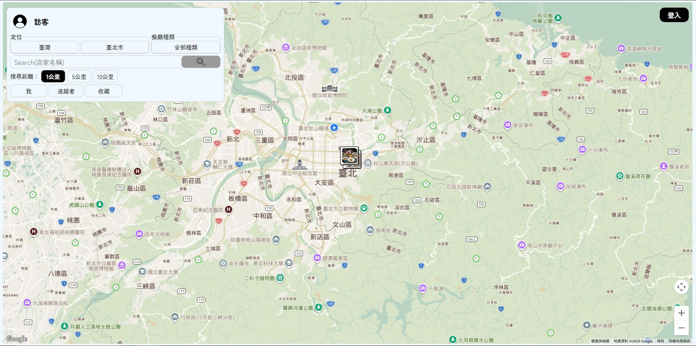
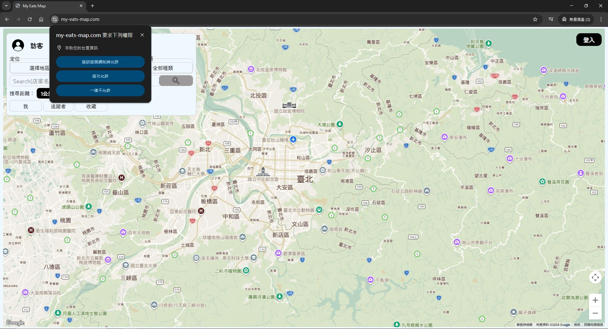
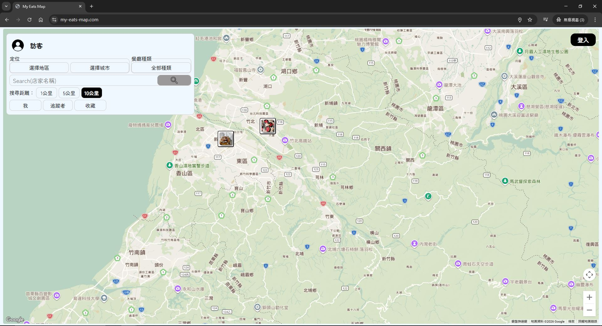
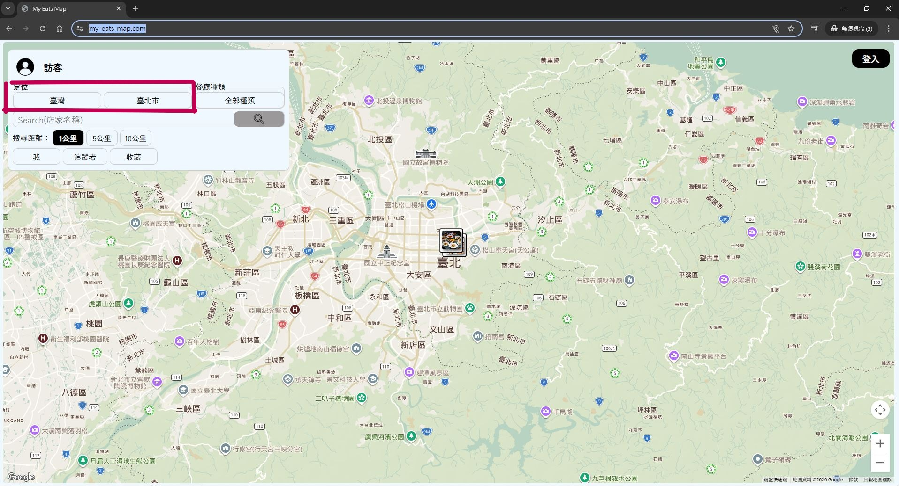
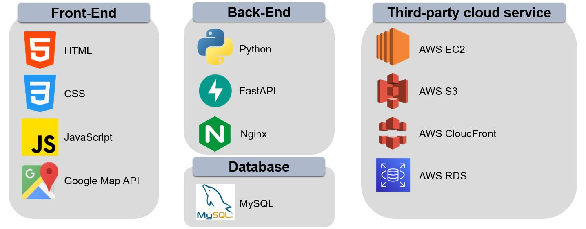
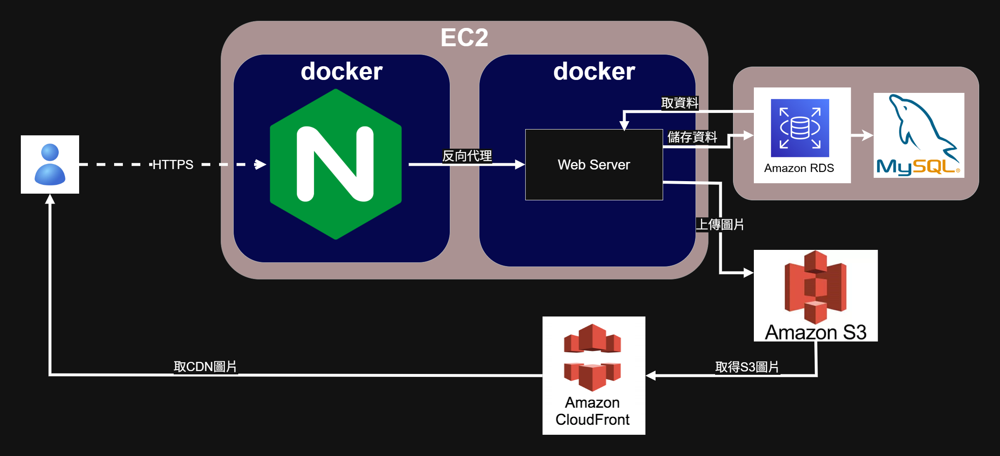
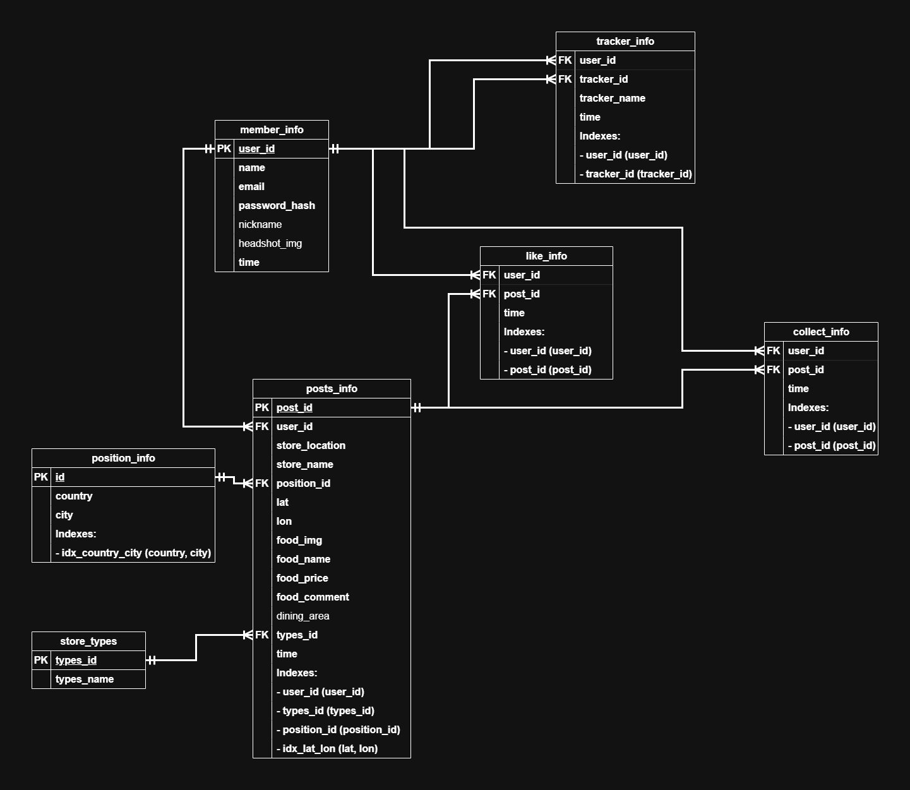

**My Eats Map**
=========================
My Eats Map網站可以透過地圖的方式，找出美食餐廳，同時，又可以推薦自己的美食口袋名單給其他人，讓所有的使用者都可以找到自己喜愛的美食。

Website：<https://my-eats-map.com/>



# 目錄
* [功能說明](#功能說明)
* [技術堆疊](#技術堆疊)
* [使用的技術說明](#使用的技術說明)
    * [串接Google Map API](#Google-Map-API)
    * [貼文搜尋方式](#貼文搜尋方式)
* [聯絡方式](#聯絡方式)


# 功能說明 
1. **定位功能說明**  
當進到首頁時，會先詢問是否可以取得使用者當下的定位位置。  
    * 使用網頁定位功能  
    若同意讓網站取得定位位置的話，就會透過定位位置的經緯度，搜尋附近範圍的相關美食貼文，並以marker的方式顯示於地圖上。  
    
    
    * 使用網頁的下拉式定位功能  
    若不同意網站取得當下定位位置，則會改用下拉式選取地區與城市的方式，取得定位的經緯度點位，再根據該城市點位搜尋附近範圍的相關美食貼文，並以marker顯示於地圖上。  
    

2. **一般搜尋方式**  
一般的搜尋方式就是透過點擊搜尋的按鈕，進行定位點、選擇的店家種類、關鍵字(店家名稱)與搜尋範圍的資訊，藉此搜尋相關的貼文。


3. **其他搜尋方式**  
    * 移動地圖  
    移動地圖的搜尋方式，則是當使用者移動完地圖，並放下抓著地圖的滑鼠時，根據當下地圖中心點作為定位點，搜尋附近範圍的相關貼文。  
    
    * 點擊『我』按鈕  
    點擊『我』的按鈕，則是會從我這個使用者發的貼文中，搜尋符合該定位點附近範圍內相關的貼文。  
    
    * 選擇任一追蹤者  
    選擇任一追蹤者則是會從該"追蹤者"發的貼文中，搜尋符合該定位點附近範圍內相關的貼文。  
    
    * 點擊『收藏』按鈕  
    點擊『收藏』按鈕，則是會從我這個使用者有收藏的貼文中，搜尋符合該定位點附近範圍內相關的貼文。  
    

4. **貼文**
    * 點擊地圖上的『marker』  
    點擊任一marker，會將該定位點的相關貼文資訊，詳細的顯示於貼文顯示介面中。  
    
    * 顯示後的操作  
    當使用者的狀態為登入後時，可以針對喜歡的貼文按讚或是收藏，若喜歡這個使用者寫的貼文，甚至可以點擊"追蹤"按鈕進行追蹤。
    
    * 建立貼文  
    (1) 可以選擇要上傳的圖片，並根據圖片輸入餐點名稱與餐點價格。  
    (2) 搜尋店家地址。  
    (3) 選擇店家地區、城市與種類。
    (4) 輸入餐點評價。
    (5) 輸入店家環境，這一部分就看個仁是否要輸入。  
    (6) 點擊『送出』按鈕，就可以建立一則貼文。  
    

# 技術堆疊
  
## 前端
* 架構：MVC架構
* 第三方套件：Google Map API
## 後端
* 部屬  
    * 使用docker打包程式碼。
    * 在AWS EC2架站。
    * 運行Nginx的image與Web Server的image。
    * 文字資料是透過AWS RDS中的MySQL資料庫進行儲存。
    * 上傳的圖片則是使用AWS S3的雲端系統進行儲存。
    * 使用者顯示的圖片，則是使用AWS CloudFront的伺服器，取S3的圖片來做顯示動作。
* 雲端系統架構圖
 
* 架構：MVC架構
* 資料庫的實體關係圖(ERD)
    * 設定的外鍵，主要都是為了避免不是資料庫的資料，對資料庫的表進行一些動作，造成幽靈資料或是在處理時導致資料庫的錯誤，但有設置外鍵的話，就會因為不是資料庫的資料，而將這一筆資料擋下來。
    * 除了可以避免外人對資料庫進行操作，例如：會員Table內其他資料有被修改，在撈取會員資料要顯示在網頁的貼文畫面上時，也不會因為會員資料有修改(例如名字、大頭照…等)，而造成需要將關聯的貼文也修改，因為都是透過會員ID取會員資料，所以不受會員Table的任何修改影響。
    * 那有設置索引的部分，則是為了當資料量一多，在設置此索引的狀況下，搜尋時可以加快搜尋到相關的資料。
    


# 使用的技術說明
<a id="Google-Map-API"></a>
## 串接Google Map API
* 首先使用<script src=https://maps.googleapis.com/maps/api/js?key=your-map-key}&loading=async&callback=initMap&libraries=marker&language=zh-TW></script>的方式，引入Google Map API，再使用Google Map函式中的方法。
* 使用google.maps.Map()方法，建立顯示於網頁中的地圖畫面。
* 使用google.maps.importLibrary("marker")方法建立地圖上的marker。
* 使用google.maps.Geocoder()取的地區與城市定位的經緯度參數。
* 使用google.maps.places.Autocomplete()方法，根據輸入的位置，提出5筆相關的地址建議，並提供使用者選擇，然後藉由.addListener("place_changed", () => {})此方法，降低呼叫API時花費的價格。
* 使用.addListener("idle", () => {})方法，取得當下地圖在網頁中的中心點經緯度。

## 貼文搜尋方式
* 先使用以下的方式，將所有貼文根據限制的範圍大約過濾出來。
    >```
    >緯度 BETWEEN 定位位置的緯度 - (範圍距離*0.01) AND 定位位置的緯度 + (範圍距離*0.01) AND 
    >經度 BETWEEN 定位位置的經度 - (範圍距離*0.01) AND 定位位置的經度 + (範圍距離*0.01)
    >```

* 再根據地區、城市、店家種類、關鍵字(店家名稱)與確認貼文的經緯度有在限制範圍內，有在範圍內的才會被回傳給前端使用。

* 確認經緯度是否有在限制範圍內的方法，是使用當下定位位置與貼文的經緯度做距離的計算，然後計算方式是使用MySQL中的ST_Distance_Sphere來進行。
    >```
    >ST_Distance_Sphere(POINT(貼文的經度, 貼文的緯度),
    >POINT(定位位置的經度, 定位位置的緯度)) < (限制範圍參數值*1000) 
    >```
* 然後當要顯示貼文的詳細內容時，則是使用LEFT JOIN的方式，將需要顯示或使用的資訊，以左表為主，右表如果找不到就填null的值。
* 承上，不過要顯示數值的參數值部分，則是使用IFNULL(右表結果, 0)的方式，當數值為null的狀況，則使用0來做為該數值。

# 聯絡方式
若有任何問題或建議，歡迎您使用下列方式與我聯絡，謝謝。  
e-mail：[aphj714@gmail.com](mailto:aphj714@gmail.com)
